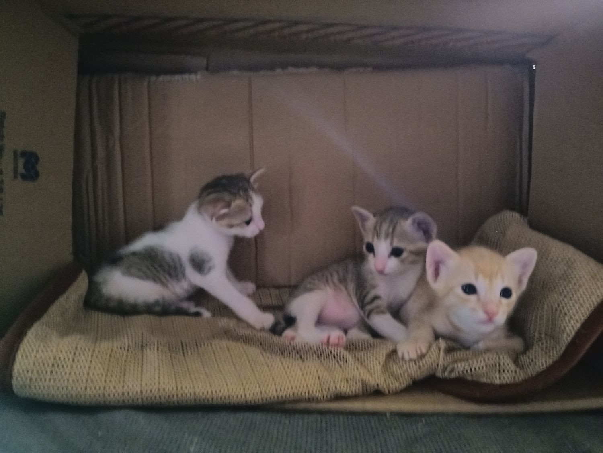

> Utility, Pleasure, and the Good.

My perception of V is limited.

He is around my age, but younger. He has talents for writing and
drawing. He is quiet, and maybe still quiet when with familiar
people. He can be direct and he is polite as well as honest. His words
are concise but clearly thought about.

Isn't that kind of well-thought-out words perfectionism? I thought to
myself. In that way, we might be similar. But V isn't perfecting his
words.

What's the chance of getting a caring friend? It should be considered
an achievement to have that kind of friend. But "achievement" is
the wrong word for being treated with the good qualities another
person possesses.

It's an honor for me to have the chance to know V's life experiences
during a period before we knew each other. I think V has the instinct to
quietly give. It's the kind of support that blends into the ambiance
but is greater than those happening explicitly because it requires love
of its truest sense.

Such a soul must be well protected because it's constantly protecting
others but neglecting itself. Such a soul needs no decoration, no
qualification, and is naturally bright and elegant.

But, V is not only a caring friend, he is wise as well. It's not the
conventional worldly wisdom. It's about people and humans. He also has
a much higher EQ I wouldn't dream of having.

Then, I feel sad. Is he absorbing other people's pain? Is he choosing
to hide his own? I hope I am just romanticizing his personality. But
how can I know he isn't?

He is the kind of person I would like to be friends with forever. Maybe
I should write a story about a magical world of monsters and
wizardry, and we should become archenemies in it, with me naturally
being an evil sorcerer. That sounds very fun.

According to Aristotle, I think we have friendship of the
good. According to Confucius, I have all the three "友直，友谅，友多闻
" kinds of friend.

Maybe no friendship lasts forever. Our friendship can be predictable
but the world is not. And I'm certainly not ready for that, which is
partly why I am recording our friendship here now. It works as a
time-capsule or a checkpoint. Besides, it's beautiful and it should
have a physical presentation. Future me might want to read this. And
today is Jul 13, 2026.

Good night.

